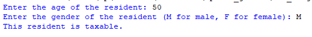

## Description
This program takes a resident's age and gender (M for male, F for female), determines and displays their tax eligibility by applying these rules: Men over the age of 20 and women between 18 and 35 (inclusive) are considered taxable residents, while others are not.
## Example

